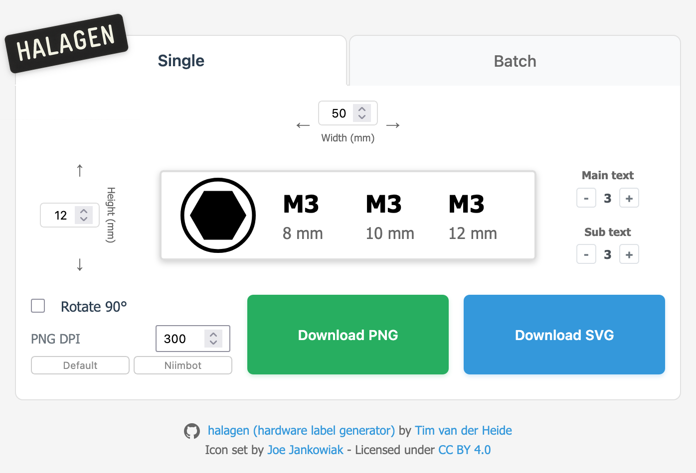
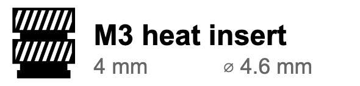
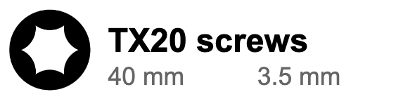
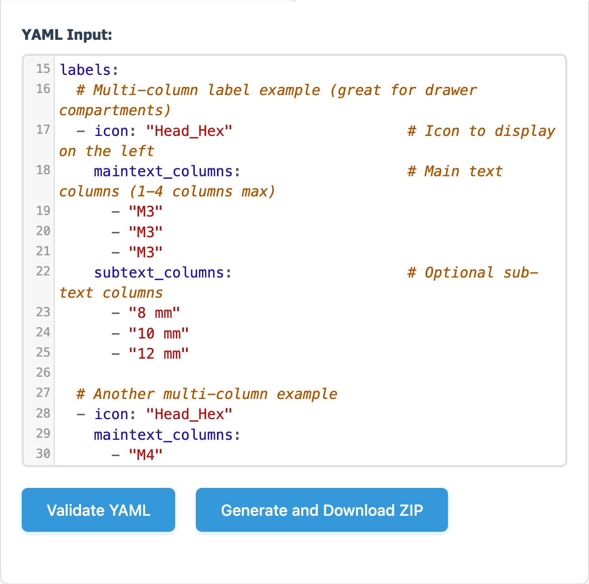

# halagen (hardware label generator)

A browser-based label generator for hardware components including screws, bolts, washers, nuts, and electrical components. Features a what-you-see-is-what-you-get editor with real-time preview window. Generate printable PNG labels with customizable dimensions and icons, ideally to be used in label-print editors like Brother's P-touch Editor.

Visit [timmmmmmmmm.github.io/halagen](https://timmmmmmmmm.github.io/halagen) to use the tool directly in your browser.

<div align="center">
  <a href="https://timmmmmmmmm.github.io/halagen">
    
  </a>
</div>

## Features

- **No backend required** - Works entirely in your browser
- **Customizable labels** - Set custom height (9-24mm) and width (20-100mm) values with precise control
- **Custom icon loading** - Upload your own icons or use the built-in collection
- **Real-time preview** - See your label at actual size before downloading
- **Multi-column support** - Create labels with multiple columns when your container has sections
- **YAML batch processor** - Generate multiple labels at once using YAML input
- **PNG export** - Download labels as high-quality PNG files ready for printing

## Example Output

Here are some examples of labels generated with halagen:
<div align="center">
<table>
  <tr>
    <td></td>
    <td></td>
    <td></td>
  </tr>
  <tr>
    <td></td>
    <td></td>
    <td></td>
  </tr>
</table>
</div>

## Multi-column labels

halagen supports multi-column labels for when your storage containers have multiple sections. This feature allows you to create a single label that covers multiple compartments, with each column representing a different section of your container. Simply specify the number of columns needed and fill in the content for each section.

## YAML batch processor

halagen includes a powerful YAML batch processor that allows you to generate multiple labels simultaneously. This feature is particularly useful when you need to create many labels at once.

**AI/LLM Integration**: The YAML format is designed to work seamlessly with AI assistants and Large Language Models (LLMs). Simply take fore example a screenshot of your hardware shopping basket or current organizer, and ask an AI to generate the YAML configuration for all the parts it can identify. This makes organizing large quantities of hardware components incredibly efficient.

<div align="center">

</div>

Example YAML format:
```yaml
# Global settings (optional)
width_mm: 50
height_mm: 12
png_dpi: 300

labels:
  - title: "M4 × 12"
    subtext: "DIN 7984"
    icon: "heads_hex_socket"
    rotate: false
  - title: "M6 × 20"
    subtext: "Hex Bolt"
    icon: "fasteners_screw_hex"
    width_mm: 45
    height_mm: 18
```

## License

This project is open source and available under the [MIT License](LICENSE).

## Icon attribution

Some of the icons in the current icon set are based on designs by **Joe Jankowiak**, available at: https://www.printables.com/model/621771-gridfinity-bin-label-icons

Used under the Creative Commons Attribution 4.0 International License (CC BY 4.0).
https://creativecommons.org/licenses/by/4.0/